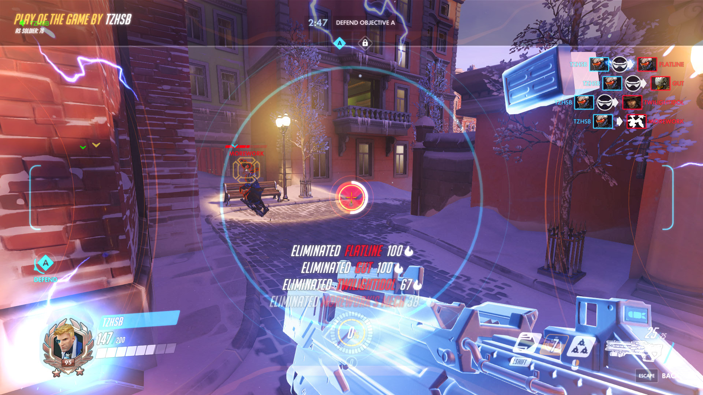
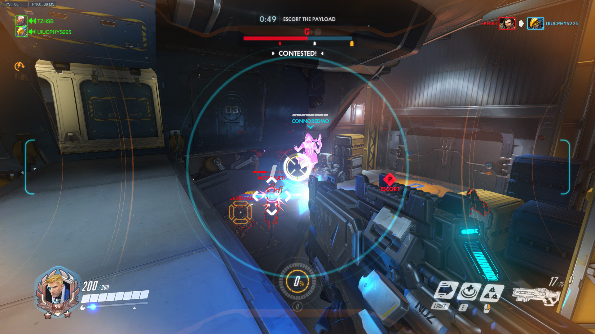
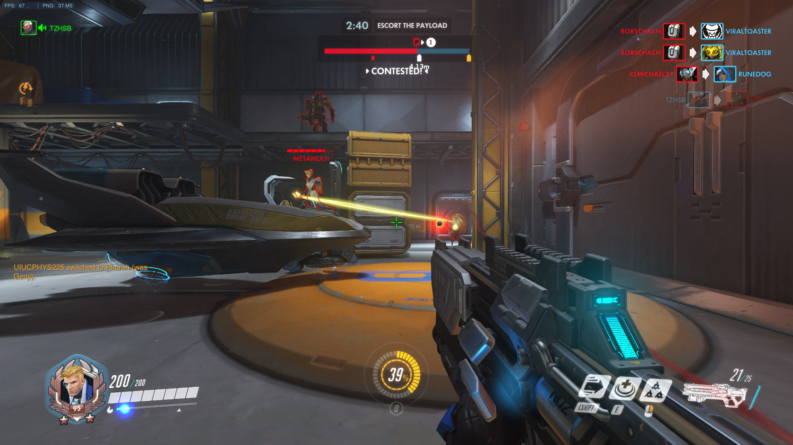

# Final Project Proposal

**Group members**: Tong Qiu (tq7bw), Charlie Wu (jw7jb), Jerry Sun (ys7va).

Introduction
----
Popular First-Person Shooter games like [Overwatch](https://playoverwatch.com) require players to have good aiming skills. Various computer vision techniques, such as edge detectors, feature detectors, and neural networks, can be used to identify targets in a game scene, and improve the accuracy of aiming. In this project, we are going to write a program that, given an input image or video (which is a set of images), identifies enemy targets in the scene and returns a list of coordinates indicating their positions.

Objectives
----
There are two major target deliverables in this project:

- A Python program that, given an input image, outputs rough target positions that can be used as data to train the neural network;

- A trained neural network model that can identify the position of enemy targets in a scene, at an optimal speed.

Specifications
----
The project will first utilize the traditional computer vision feature to label data. The neural network will then come into play in order to find a quick and reliable inference method.

#### Difficulties
There are several major challenges we need to handle during the implementation of our project:

- Game scenes involve a lot of noises, such as protective barriers, effects of character skills, and other irrelevant features;

    

- Multiple targets can co-exist in a single scene, and it’s necessary to identify all of them;

    

- Performance of the program must be guaranteed to provide real-time data to help with aiming.

#### Pipelined implementation
1. Raw dataset from screen record in real game:

2. Dataset labeling with traditional CV algorithms:
    - Denoise the picture
    - Apply red filter, since the target is always surrounded by red lines
    - Canny edge detection
    - Remove irrelevant object
    - Generate correct label

3. CNN network:
    - Input real game image data
    - Output position(s) to aim

Responsibilities
----
- Jibang Wu: Neural network implementation and debugging.

- Tong Qiu: Sample images collection and manual labelling, code debugging and testing.

- Jerry Sun: CV related algorithm (Real-time canny edge detector, etc.) implementation.
